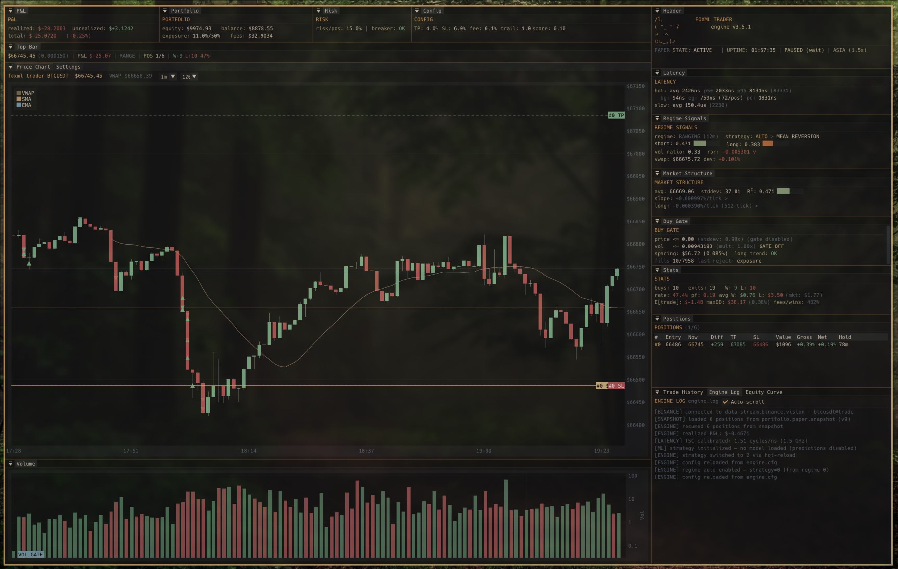
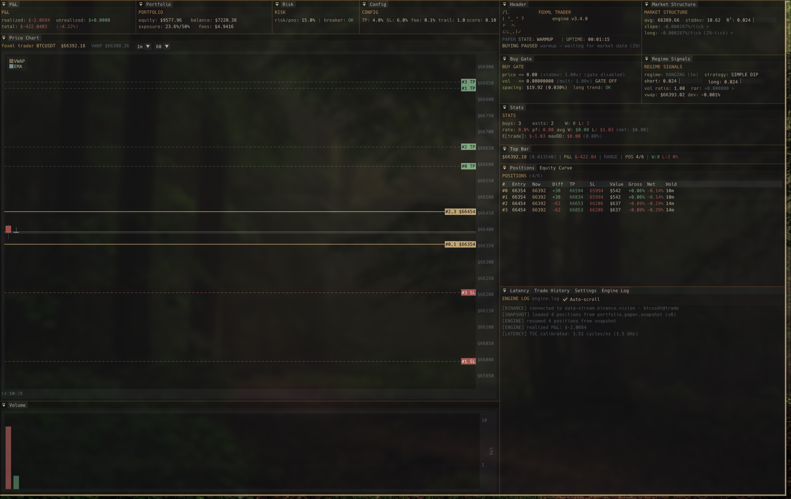
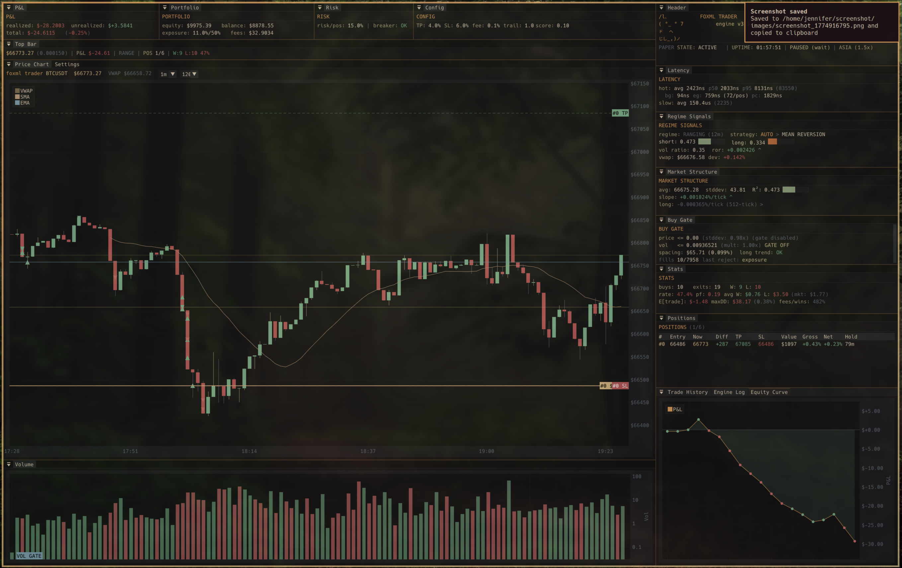

# FoxML Trader

Tick-level crypto trading engine + ML backtesting suite in C++. Branchless fixed-point arithmetic, bitmap-based portfolio management, regime detection with EMA/SMA crossover, and integrated XGBoost training pipeline.

Built from scratch as a learning project — no frameworks, no black boxes.

> **Note:** This is a learning/research tool, not financial advice. Use at your own risk.





## Features

### Execution Engine
- **Tick-level execution**: every market tick processed in <100ns on hot path
- **Fixed-point arithmetic**: 4096-bit FPN (64 words) — no floating-point rounding in any accounting path
- **Branchless hot path**: mask-select patterns eliminate branch misprediction on buy gate + exit gate
- **Bitmap portfolio**: `uint16_t` active bitmap — O(popcount) position walks, no linked lists
- **Live trading**: Binance websocket (market data) + REST API (orders)
- **Paper trading**: full simulation with configurable fees, slippage, and balance

### Strategies & Regime Detection
- **Regime detection**: EMA/SMA crossover with score-based classification (RANGING / TRENDING / TRENDING_DOWN / VOLATILE / MILD_TREND)
- **4 strategies**: Mean Reversion, Momentum, SimpleDip, ML (model-driven) — extensible via StrategyInterface
- **Adaptive gates**: P&L regression shifts entry filters — winning = widen, losing = tighten
- **Trailing TP/SL**: R²-scaled exit adjustment for momentum positions

### Risk Management
- **Sticky kill switch**: daily loss or drawdown limit breach halts buying until session reset
- **Vol-scaled sizing**: position quantity scales inversely with volatility
- **No-trade band**: suppresses entries when signal strength < fee breakeven
- **SL floor invariant**: stop-loss can never be closer than half the TP distance
- **24-hour session lifecycle**: warmup → trade → wind down → close all → reconnect

### FoxML Suite (Backtest + ML Training)
- **Tick-accurate replay**: runs the real engine on historical data (same code path as live)
- **ML feature collection**: packs RollingStats + RegimeSignals into feature vectors
- **XGBoost training**: train models in C++ — no Python needed
- **Walk-forward validation**: purged temporal CV with overfitting detection
- **Barrier labels**: TP/SL barrier hit labeling with neutral filtering
- **Overfitting detection**: per-fold memorization checks (train accuracy, gap analysis)
- **Optimizer**: grid search over config parameters with metric comparison

### Interface
- **Native GUI**: Dear ImGui + implot (SDL2/OpenGL3) — dockable panels, candlestick charts, live settings editor with tooltips
- **ANSI TUI**: zero-dependency terminal dashboard with diff-based rendering
- **68 hot-reloadable config fields**: edit engine.cfg while running, press `r` to reload

## Quick Start

```bash
# clone and build (ANSI TUI — zero dependencies)
git clone https://github.com/Jennyfirrr/FoxML_Trader.git
cd FoxML_Trader
cmake -B build && cmake --build build

# configure
cp engine.cfg.example engine.cfg    # edit with your settings

# run
cd build && ./engine

# run tests
./build/controller_test
```

### GUI Build (SDL2 + OpenGL3)

```bash
# install deps (Arch: sdl2, Ubuntu: libsdl2-dev)
cmake -B build_gui -DUSE_IMGUI_GUI=ON
cmake --build build_gui
cd build_gui && ./engine_gui
```

### FoxML Suite (Backtest + ML Training)

```bash
# requires XGBoost C library (see below)
cmake -B build_suite -DUSE_IMGUI_GUI=ON -DUSE_XGBOOST=ON
cmake --build build_suite --target foxml_suite
cd build_suite && ln -s ../data data
cp engine.cfg.example backtest.cfg
./foxml_suite
```

The suite replays historical tick data through the real engine, collects ML features, trains XGBoost models, and validates with walk-forward cross-validation. See [DOCS/ML_USAGE.md](DOCS/ML_USAGE.md) for the full workflow.

#### XGBoost C Library (build from source)

```bash
git clone --recurse-submodules https://github.com/dmlc/xgboost.git /tmp/xgboost
cd /tmp/xgboost && mkdir build && cd build
cmake .. -DBUILD_STATIC_LIB=OFF && make -j$(nproc)
sudo make install && sudo ldconfig
```

## Architecture

```
HOT PATH (every tick, <100ns):
  BuyGate (branchless) -> OrderPool
  PositionExitGate (branchless bitmap walk) -> ExitBuffer
  Fill consumption (every tick — zero unprotected exposure)

SLOW PATH (every N ticks):
  RollingStats (least-squares regression, VWAP, R²)
  RegimeDetector (EMA/SMA crossover → score-based classify)
  Strategy dispatch → adaptive gate adjustment
  ML inference (if enabled) → model_score → buy signal
```

## Project Structure

```
CoreFrameworks/   OrderGates, Portfolio (bitmap), PortfolioController (feedback loop)
Strategies/       RegimeDetector, MeanReversion, Momentum, SimpleDip, MLStrategy
ML_Headers/       RollingStats, ModelInference, BanditLearning, CostModel, VolScaler
DataStream/       BinanceCrypto (websocket), EngineTUI (snapshot), TUIAnsi (renderer)
FixedPoint/       FPN arbitrary-width fixed-point arithmetic library
GUI/              Dear ImGui panels (dashboard, chart, settings, trade history, log)
Backtest/         BacktestEngine, BacktestPanels (suite GUI), LabelFunctions, ValidationSplit, OverfitDetection
tests/            controller_test.cpp
```

## Build Options

| Flag | Description |
|------|-------------|
| `-DUSE_IMGUI_GUI=ON` | Native GUI (requires SDL2 + OpenGL) |
| `-DUSE_NATIVE_128=ON` | Native `__uint128_t` FPN (default) |
| `-DUSE_XGBOOST=ON` | XGBoost C API for ML training + inference |
| `-DUSE_LIGHTGBM=ON` | LightGBM C API for ML inference |
| `-DLATENCY_PROFILING=ON` | RDTSCP latency profiling |
| `-DBUSY_POLL=ON` | Spin-poll (lower latency, higher CPU) |

## Configuration

Copy `engine.cfg.example` to `engine.cfg` and edit. All parameters are hot-reloadable.

```cfg
# example: ML-driven trading
ml_backend=1                    # 1=xgboost, 2=lightgbm
ml_model_path=models/buy.xgb
ml_buy_threshold=0.60           # prediction > 0.6 = buy signal
```

The GUI settings panel exposes all config fields with hover tooltips.

## TUI Controls

| Key | Action |
|-----|--------|
| `q` | Quit |
| `p` | Pause/unpause buying |
| `r` | Hot-reload config |
| `s` | Cycle regime (manual override) |
| `k` | Reset kill switch |
| `l` | Cycle TUI layout |

## Platform Support

- **Linux**: fully tested (Arch, Ubuntu)
- **Windows**: WSL2
- **macOS**: untested — deps via Homebrew

## License

AGPL-3.0 — see [LICENSE](LICENSE)
